

# NanoEdge AI Studio - Overview Handbook

Welcome to Empa Electronics' first University Workshop event, Yıldız Technical University Workshop!

This handbook will guide you to apply development steps of our Human Activity Recognition application using NanoEdge AI Studio.  

# 1. Introduction

### What it is?

- It provides **embedded** **engineers**, even those **without prior AI knowledge**, effortlessly identify the ideal AI model for their specific requirements.
- Originally developed by **Cartesiam** (now owned by **ST**), for embedded C software running on MCUs.

### How it works?

- **Operates** **locally** on a PC
- **Takes** input data
- **Explores** thousands of combinations of pre-processing, models, and parameters
- **Generates** a library (model, its preprocessing, and functions)

### What cannot it do?

- Does **not** provide any input data. **Users need to have qualified data.**
- Does **not** provide any **ready-to-use C code** to implement in the **final** project.
- NEAIS is mainly **made for sensor applications**.

### Features

- Requires **no ML expertise**
- Memory **efficient**
- **Optimized** to run on MCUs
- **Fast**

### General Steps

- **Configure**
- **Import** signals
- **Benchmark**
- **Find & compare** a library (model)
- **Test** the library
- **Deploy**

### Benchmark Steps

- Signal **pre-processing**
- **ML model**
- Optimal **hyperparameter** search

## Pre-processes

- **Data Logger (DL)**
- **Data Manipulation (DM)**
- **Sampling Finder (SF)**

## Models

- **Anomaly Detection (AD)**
    - “I want them to autonomously adapt to their target environment and detect anomalies by themselves.”
- **1-Class Classification (1CC)**
    - “I want to detect any outliers.”
- **n-Class Classification (nCC)**
    - “I want to know by name what problems are occurring.”
- **Extrapolation (E)**
    - “I want to anticipate the vibration level so that I have time for corrective actions.”

# 2. Pre-processes

NanoEdge AI Studio is mainly made for **sensor** applications, and sensor applications consist of **time series** data. Therefore, users need to use appropriate input data for these applications, so the models can be constructed correctly.

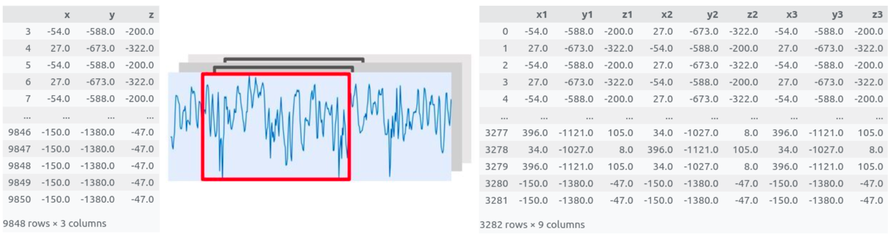

## 2.1. **Data Logger (DL)**

- Outputs a **ready-to-use** .bin file with **selected configuration** to collect data from USB port.
    - From compatible **boards**,
    - The list of **sensors** available,
    - The list of **parameters** (sample size per axis, range, data range, number of axis) specific to the selected sensor.
- The .bin file is to **embed** into the selected card. *STM32CubeProgrammer* can be used for this task.

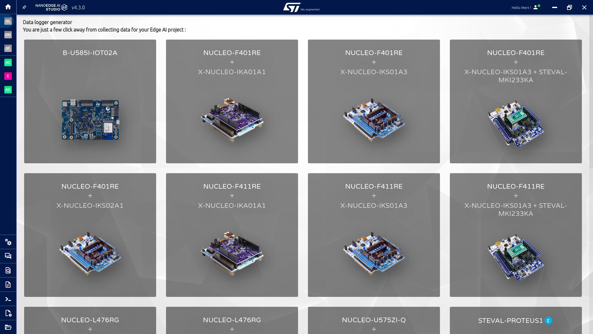

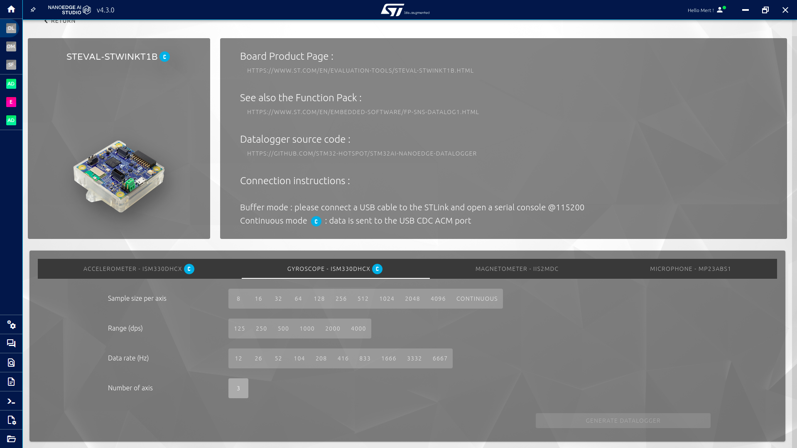

## 2.2. **Data Manipulation (DM)**

- Outputs data file(s) after applying the selected actions on the given dataset(s).
    - **Extract** lines,
    - **Remove** columns,
    - Change columns numbers (i.e. **sampling size**),
    - **Shuffle** rows.

## 2.3. **Sampling Finder (SF)**

- For **continuous** **data**, SF determines the *smallest* possible **sampling size** and **sampling duration** to maintain **highest score** during benchmark.
- **Inputs:**
    - Class files to differentiate,
    - Number of axes used,
    - Sampling frequency used,
    - Minimal frequency to test.

# 3. Models

## 3.1. **Anomaly Detection (AD)**

- **Detects anomalies** in data,
- Uses **dynamic** models.
- **Dynamic** model gives great **adaptability**, to make the model work on different targets or slightly different conditions. This brings the **ability of train differently** to model for **adapting** itself.
- Studio outputs **untrained** AD model that **learns incrementally** directly on the target MCU.

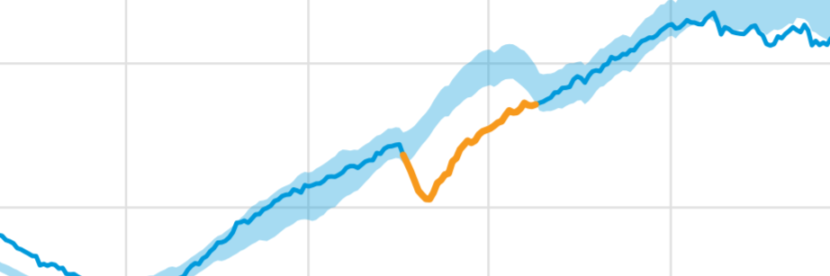

## 3.2. **1-Class Classification (1CC)**

- **Detects anomalies** in data,
- Uses **static** model.
- Studio outputs **pre-trained** outlier detection model that **only** **infers** on the target MCU.

## 3.3. **n-Class Classification (nCC)**

- **Classifies** *n* different states,
- Uses a **static** model,
- Studio outputs **pre-trained** classification model that **only infers** on the target MCU.

## 3.4. **Extrapolation (E)**

- **Estimates** an unknown target value (all other library types uses **discrete** classes),
- Uses a **static** model,
- Expects labels in the dataset, does **not** accept USB inputs,
- Studio outputs a **pre-trained** regression model **only infers** on the target MCU.

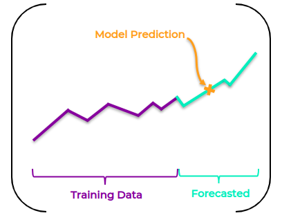

# 4. Setup

Available for **Windows** and **Ubuntu**.

### [https://stm32ai.st.com/download-nanoedgeai/](https://stm32ai.st.com/download-nanoedgeai/)

## 4.1. Filling the Form

By filling the form, users will be able access to **download link** and **license key** from their **e-mail**.

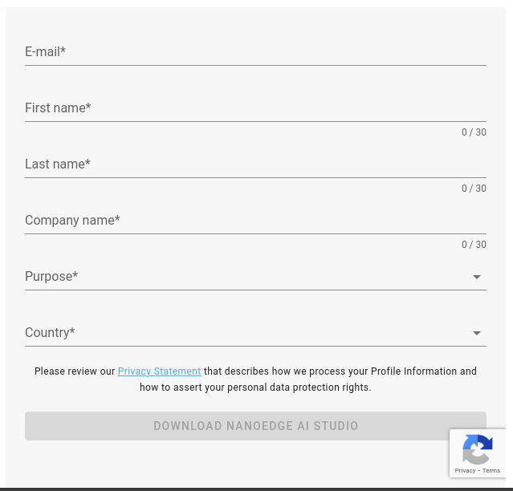

## 4.2. Installing the NanoEdge AI Studio via Windows Executable

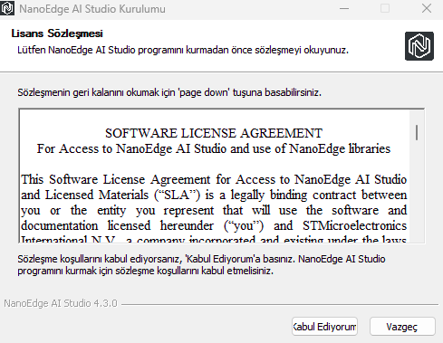

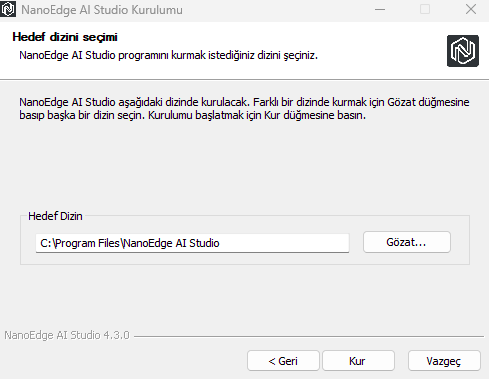

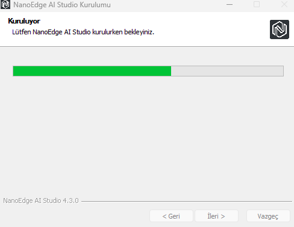

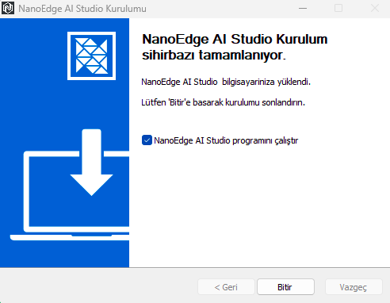

## 4.3. Installing the NanoEdge AI Studio via Ubuntu .deb File

- Right click the downloaded .deb file,
- Click the “Open with **Software Install**” option,
- Click the **Install** button.

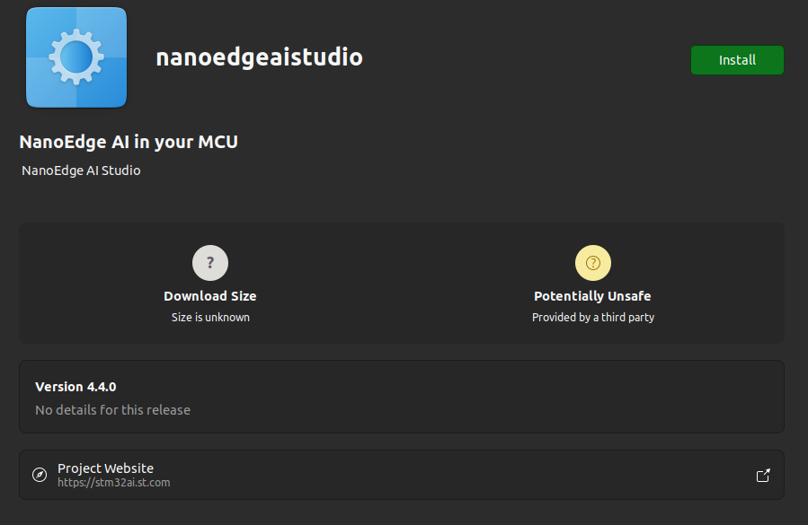

## 4.4. License Key

Users can get their **license keys** from their **email**.

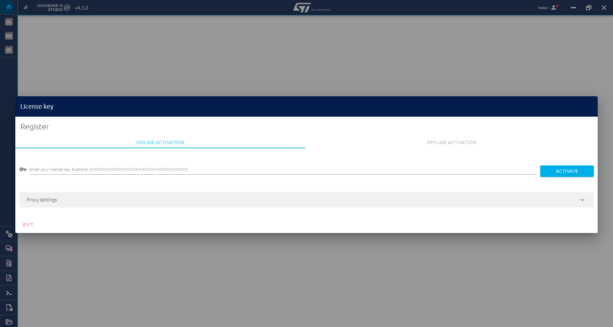

# 5. End-to-end Deployment Steps

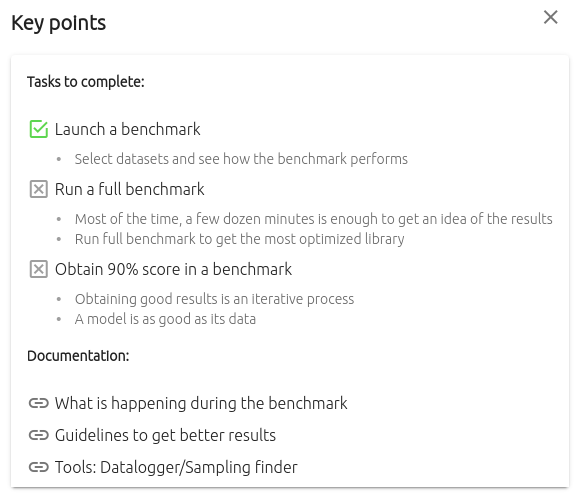

NanoEdge AI Studio gives **tips** to users for nearly every part of the process. By applying the tips, users may increase the outcome significantly.

## 5.1. Project Settings:

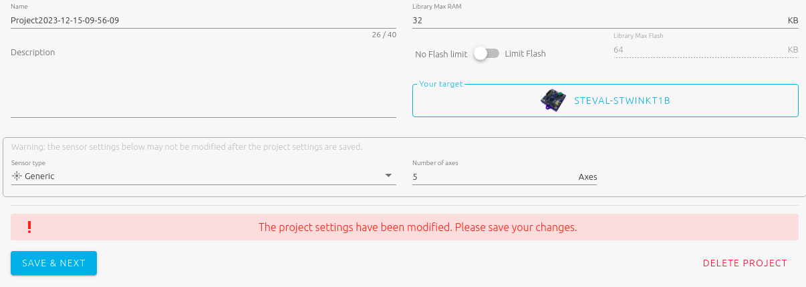

- **Target** Sensor Model
    - User needs to select the target sensor model to embed AI model, not the sensor model for data collection.
- **Sensor** **Type**
    - Current Sensor 1 Axis
    - Microphone 1 Axis
    - Accelerometer (1-2-3 Axes)
    - Hall Sensor (1-2-3 Axes)
    - Generic:
        - If the sensor type is not in the list above, or in the case of using multiple sensors, users must select **generic** sensor.
    - Multi-sensor:
        - In anomaly detection projects (only), the **Multi-sensor** sensor is used to monitor machine "states" that typically evolve slowly in time. These states can be represented by variables coming from **distinct sensor sources**, and/or result from the aggregation of signal buffers into artificial, higher-level features.
- **Number of Axes / Variables**
    - **IMPORTANT:** NEAIS divides the column number to the number of axes, to check the number of samples using in data. (i.e., 3 axes accelerometer and 3 axes gyroscope are used to collect the data, and the data is sampled by using 128 sensor readings. In this configuration, one line of data will consist of 128 samples * 6 axes = 768 columns.)
    - This option will be passive if the Sensor Type is not Generic or Multi-sensor.
- Model’s (Library’s) **max RAM** & **max Flash**
    
    

## 5.2. Signals:

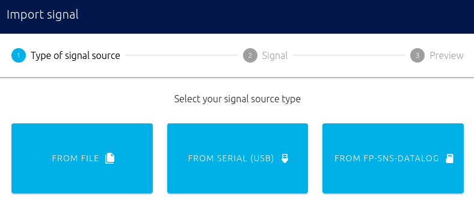

- **From File**
    - Select different files for each class.
    
    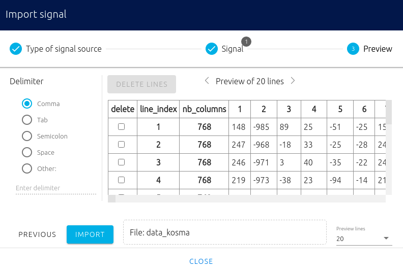
    
    - After selecting the files, the datasets can be seen. If the data is **not** suitable, the NanoEdge AI Studio will highlight the parts are not suitable for training, and the user has to fix it.

- **From Serial (USB):**
    - Get data directly from USB.

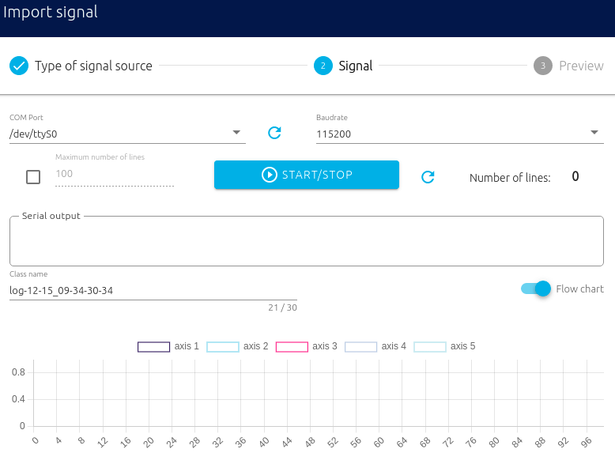

- **From SD Card**
    - For now, SD Card option directing to the From File option.

### After importing the data:

- Axes are columns of the data (i.e. features)
- If the data is suitable, the NanoEdge AI Studio applies **Fourier Transform** to data, so the signals can be seen in the Frequency Domain.

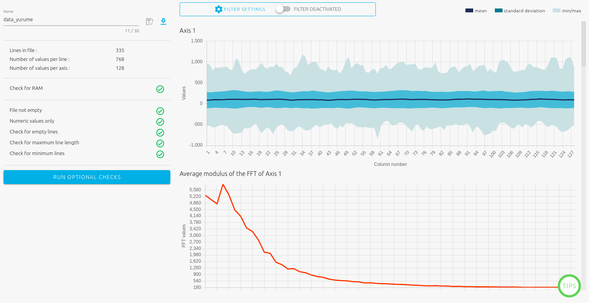

- Toggle "**Filter**" if the user wants to **remove unwanted frequency** components from the input signals. You may select cutoff frequencies to restrain your signals to a precise frequency window.

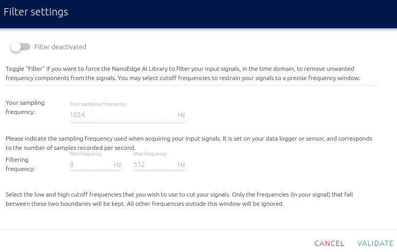

## 5.3. Benchmark (Model Training)

In this section, the benchmark can be started with the **selected signals (classes)** and **number of CPU cores to use for benchmark** options. 

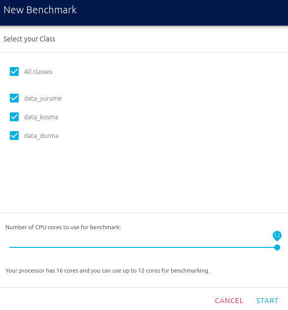

**In this window, every selected data is considered as a separate class!**

The benchmark will start in couples of seconds after clicking the Start button.

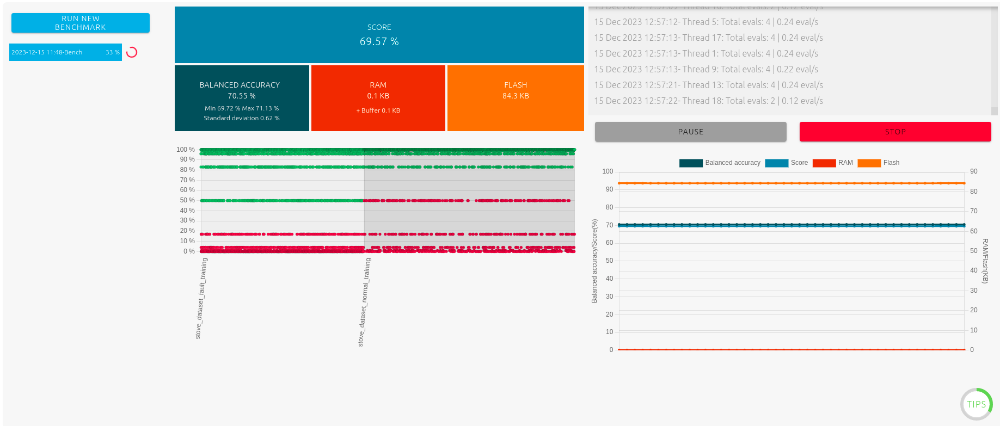

On the benchmark screen, the user can see the followings:

- **Status** of benchmark,
- **Progress** of benchmark and its time stamps,
- **Performance** indicators,
- **Log** window (Benchmark status, search speed per thread, new libraries found, etc.),
- **Evolution** of performance over time,
- **Pause** & **Stop** buttons.

After the benchmark, users are allowed to **select** one from all libraries that are trained.

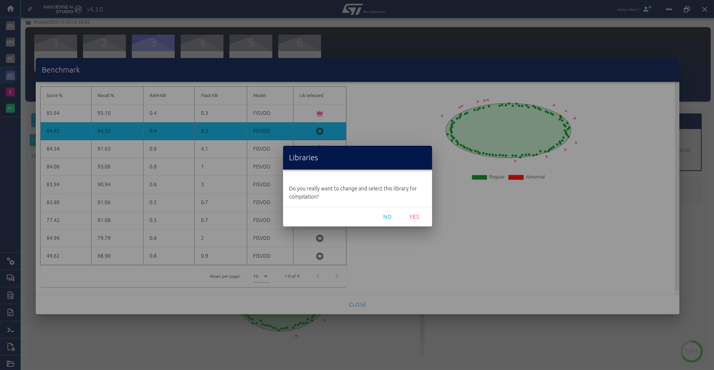

## 5.4. Validation

Gives a chance to user of **comparing the models** by using test data and **selecting the preferred model**.

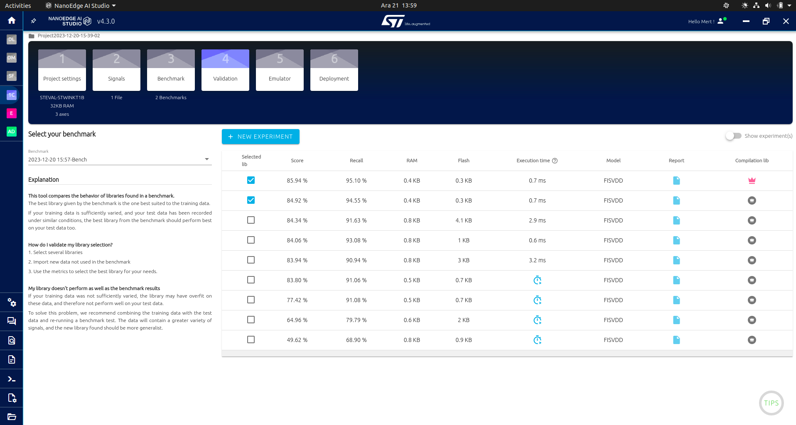

## 5.5. Emulator

Allows for **emulating** the model **directly inside the NanoEdge AI Studio**.

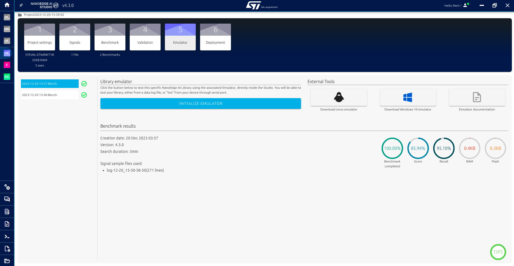

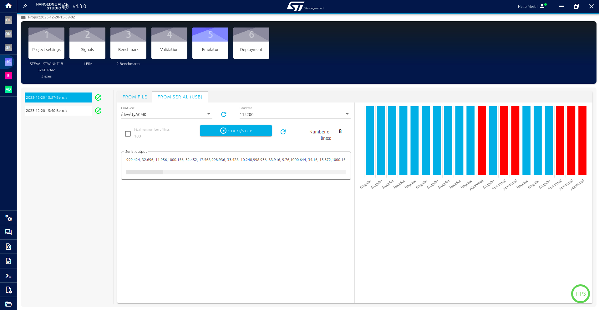

## 5.6. Deployment

- Users can get the **trained model library** and C code snippet by using **compile library** button.
- The snippet is a **guide** for implementing and using the model on the target sensor.

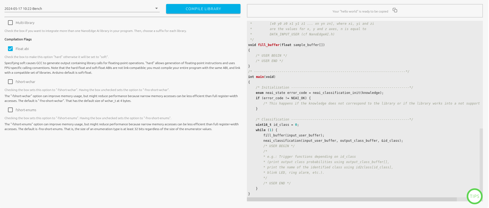