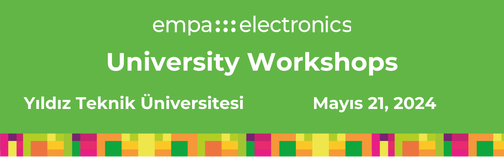

<p align="center"></p>


## University Workshops'a Hoşgeldiniz!

Merhaba, 

Empa Electronics tarafından düzenlenen üniversite workshopları serimizin ilkine, Yıldız Teknik Üniversitesi Workshop'a hoşgeldiniz. 

Bu kurulum kılavuzu, workshop etkinliğimizin AI seansı için sizleri bilgilendirmek ve aktivitelerimizi adım adım, eş zamanlı uygulayabilmek için gerekli kurulumlara yönlendirmek amacıyla hazırlandı.

Bu dökümanı kullanarak:

- Hazırlanan tüm özgün dosyalara, içeriklere ve model çıktılarına ulaşabileceksiniz. 
- Tüm ön gereksinimleri edinebileceksiniz.
- Hazırlanan kod deposunu (_clone komutu ile_) edinebileceksiniz.
- Python sanal ortamı oluşturmada gerekli "virtualenv" aracını edinebileceksiniz.
- Python sanal ortamı oluşturabilecek ve gerekli kod paketleri ile aktive edebileceksiniz.
  

> **Önemli Not** Etkinliğimizde kullanılacak içeriklerin güncel tutulması için, etkinliğimize gelmeden hemen önce güncellemeleri kontrol etmenizi öneririz:
```
git pull origin master
```

## AI Seansı Aktiviteleri

Etkinliğimizin AI seansında sizi _dört_ farklı aktivite ile konuk ediyoruz. Öncelikle bir problem tanımlayacağız, ardından bu problemin çözümü için iki farklı yol ile geliştirme sürecini deneyimleyeceğiz!

| Aktivite | Tahmini Zaman | Gereksinimler |
| ------ | ------ | ------ | 
| Problem Tanımı - İnsans Aktivitesi Sınıflandırma | 10 dk.| - |
| Machine Learning Flashback | 15 dk.|  - |
| El Yordamı ile ML Çözümleri Geliştirme | 25 dk.| Python3 & Sanal Ortam|
| Alternatif Yol - NanoEdge AI Studio ile Çözüm Geliştirme | 25 dk.| NanoEdge AI Studio |

## Ön Gereksinimler

- Python3 (Tercihen 3.9 ya da 3.10) ([realpython.com/installing-python](https://realpython.com/installing-python))
- Git ([git-scm.com - Installing-Git](https://git-scm.com/book/en/v2/Getting-Started-Installing-Git))
- Nano Edge AI Studio ([stm32ai.st.com/download-nanoedgeai/](https://stm32ai.st.com/download-nanoedgeai/))
- Workshop Kod Deposu (Repository) & Python Sanal Ortamı ([See Below](github.com/Empa-Teknoloji/Workshop_YTU#before-we-meet))

Lütfen linklere tıklayınız ve gerekli kurulum adımlarını takip ediniz.

## Sanal Ortam Kurulumu

Etkinliğimizde kullanılacak Python sanal ortamını eksiksiz şekilde edinmek için, aşağıdaki adımları kendi lokal geliştirme makinenizde (_terminalinizde çalıştırarak_) takip ediniz.  

1- Kod deposunu kendi lokal geiştirme makinenize indiriniz (_clone repository_):
```
git clone https://github.com/denizcelikai/AI_Workshops_YTU.git
```
2- Sanal ortam için gerekli aracı kurunuz:
```
// Ubuntu için
sudo apt install virtualenv

// Windows için
pip3 install virtualenv
```
3- Python sanal ortamını oluşturunuz ve terminalinizde aktive ediniz:
```
virtualenv WORKSHOP_ENV

// Ubuntu için
source WORKSHOP_ENV/bin/activate

// Windows için
.\WORKSHOP_ENV\Scripts\activate
```
4- Kod deposu klasörü içine giderek gerekli paketlerin kurulumunu yapınız:

```
cd Workshop_YTU
pip3 install -r requirements.txt
```
_Buraya kadar geldiğinizde her şey düzgün görünüyor ise katılım için hazırsınız._ :blush: